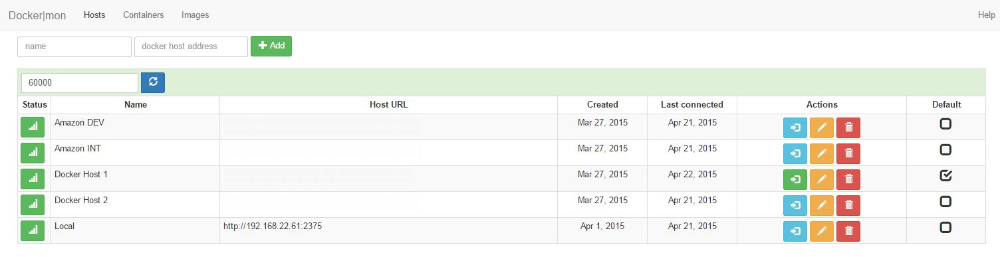
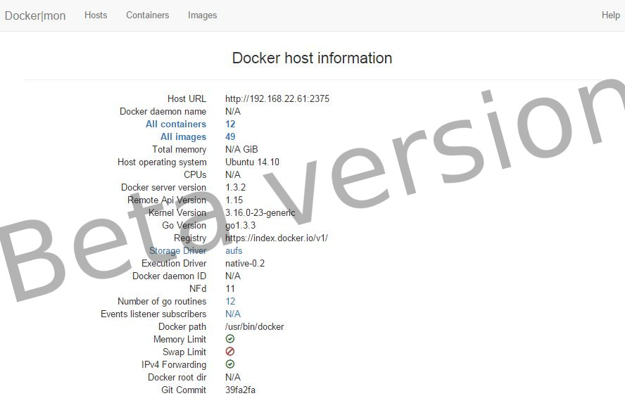
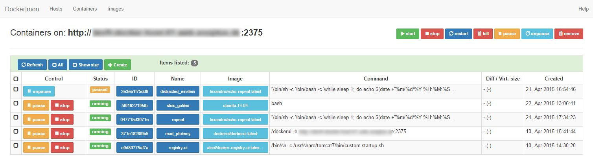
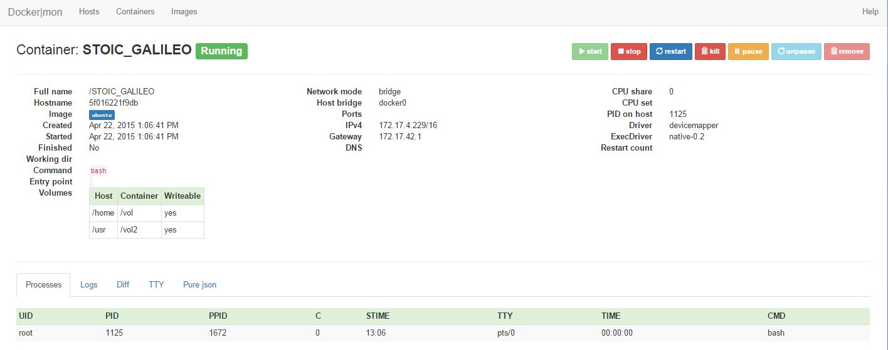
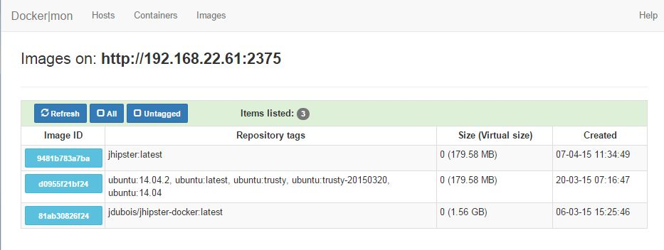
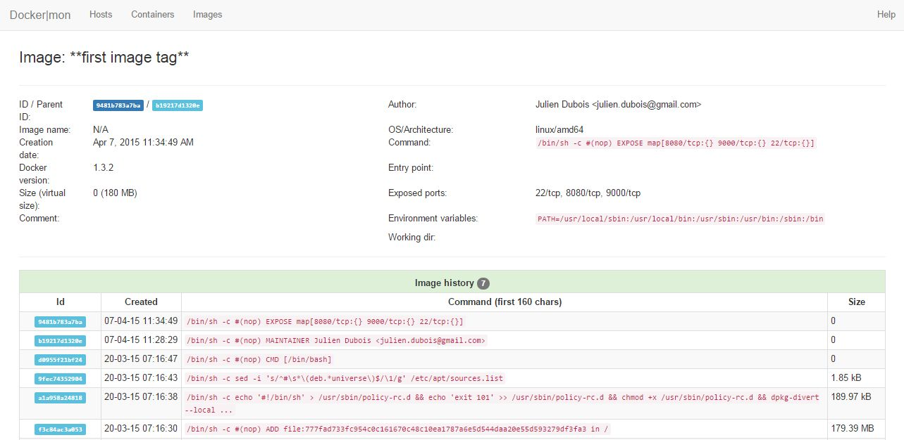

# dockery

Blueprint web application for my bigger idea to make docker based systems more manageable. This is a standalone solution 
to manage few docker hosts and do some regular tasks on containers and images. 

<a target="_blank" href="https://chrome.google.com/webstore/detail/dockery-light/cefhojablgaokgccloekpocgmffgecmm">
</img>
</a>
 
### Table of Contents
**[Enable remote access to a Docker daemon](#enable-remote-access-to-a-docker-daemon)**  
**[Run as docker container](#run-as-docker-container)**  
**[Beta screenshots](#beta-screenshots)**  
**[Development roadmap](#development-roadmap)**  
 

## Enable remote access to a Docker daemon

To manage your docker host(s) with **dockery** please please add the following parameters to your Docker daemon launcher:

```bash
 $ docker -d -H=0.0.0.0:2375 -api-enable-cors
```

or edit your **/etc/default/docker** file:

```bash
DOCKER_OPTS='-H tcp://0.0.0.0:2375 -api-enable-cors'
```

A more recommended approach:
```bash
DOCKER_OPTS="--dns 8.8.8.8 --dns 8.8.4.4 -H tcp://0.0.0.0:2375 -H unix:///var/run/docker.sock -api-enable-cors"

```

then issue the following command to activate changes:
```bash
service docker restart
```
## Run as docker container
dockery is released as an nginx backed docker image to make it easier to use. The image is auto updated by every push with the **latest** tag, the versioning will be added 
after the first official releaseing

**get the image**
```bash
docker pull lexandro/dockery
```

**start the image**
```bash
docker run -d -p 80:80 --name dockery lexandro/dockery
```
## Beta screenshots
These screenshots are not representing the final version!

### List of docker hosts


### Host details


### List of docker host containers


### Docker container details


### List of docker host images


### Docker image details


# Development roadmap
Here's the list of active, scheduled, planned and finished development goals

## Under development
0.2.8
- Add: image search/pull to the image list view (from the public repo)

## Roadmap /by priority/
0.2.9
- Add: link containers in Create

0.3.0
- Add: add search for container diff

0.3.1
- Add: helper links to the known fields/information pieces to help understand
- Add: In Chrome mode add Settings view to enable synced storage usage  

0.3.2
- Add: exit code filter to container list view 
- Add: status filter to container list view

0.3.3
- Add: login into the docker hub and/or private repo(s) 
- Add: search/pull image from private repo(s) 

0.4.0
- Fix: redesign host information page...drastically++ :)

0.4.1
- Add: download file link to containers/container details/diff listing items

0.4.2
- Add: also add tooltips to these items on all views

0.5.0
- Fix: make it more responsive

0.5.1

- Add: option to show containers logs as formatted/raw 
- Fix: TTY terminal doubling characters in some cases.  

0.5.2 
- Add: set refresh interval on container listing
- Fix: Adding new host sometimes causing index by errors.

0.6
- Add: show containerdetails/ cpu/network datastream as diagram/graph or stg. else 

0.6.1
- Add: paging of containers
- Add: select all/select page on containers

0.6.2
- Add: paging of images
- Add: select all/select page on images

0.6.3
- Add: export/import hosts list

## Not scheduled
- Help
- docker image with version check in the webapp
- Add copyright when released or published (xterm.js, json-formatter)

## Far future, not decided yet
- Customize fields in lists (show,noshow)
- Better error handling for create container. Much better.
- Presets for create container page
- Make features docker host remote api version aware. Hide non-existing functions
- Redesign layout from top menu to side menu
- Add repeated pinging to containers (the list and per container)
- Detect fig/compose naming pattern
- Grep colored logs on container with pluggable patterns
- Multiple container log tailing with one click/window
- Ping open ports for spring actuator endpoints (health, ping, info, etc...) Risky...
- Ping open ports for swagger endpoint (/api_docs)
- Swarm support
- compose yml support
- Add: list last n items to container list view
- Add: list since filter to container list view 
- Add: list before filter to container list view

## Done
0.1.1
- Add: log view to containers/container details/diff listing

0.1.0
- Add: go first, go last to containers/container details/diff listing

0.1.2
- Add: TTY view to containers/container details/tty listing

0.1.3 
- Add: container details diff view: refresh button 
- Fix: finish container details page TBD items
- Fix: make containers/container details head smaller
- Fix: Don't call top when container is stopped
- *not fixed*: Don't cut down first character on displayed container name when the first char differ from '/' - replaced with Full name feature.

0.1.4
- Add: "Please wait..." view/anim for time consuming operations (container size, diff, ps, etc...)
- Fix: default connection issue (two green buttons on hosts view)
- Fix: image details view error with root images/no port exposed images because of a missing property

0.1.5
- Add: start/stop/pause/kill/etc.. button to container list view to manage containers
- Fix: select all containers, not selected all containers properly.

0.1.6
- Add: start/stop/pause/kill/etc.. button to container details view to manage a container
- Add: group containers by their state [running, paused, stopped]
- Fix: loading process always displayed on stopped containers
- Fix: no previuously loaded top data shown for just stopped containers on the containersdetails page

0.1.7
- Add: containerdetails/volumes
  
0.1.8
- Rescheduled

0.1.9
- Add: rename container to container list view - Remote api version dependent feature
- Add: release automatically in docker image format
- Fix: display port assignments [exposed image without public, exposed with -P, exposed with -p, portless image with -P, portless image with -p]
- Fix: image non-port exposure issue at: http://localhost:63342/dockery/app/imageDetails/imageDetails.js:23:63

0.2.0
- Rescheduled

0.2.1
- Add: create container page - basic
- Fix: select all in containers can't be change (it' all or nothing)

0.2.2
- Add: image deletion to the image list view
- Add: create container: name format check 

0.2.3
- Add: sort by table header fields in containers list
- Add: sort by table header fields in images list

0.2.4
- Add: filter by table header fields in containers list
- Add: filter by table header fields in images list

0.2.5
- Add: container details/volumes-from (get volume from other containers)
- Add: privileged containers should show warning color in details or maybe in the lists too
- Add: display privileged container on container details page
- Add: mark privileged containers on container list page
- Add: Show environment variables on container details page

0.2.6
- Add: tag list to the image details
- Fix: show image name in the image details
- Fix: use image ID in container list link, because the 'namespace/repo:tag' is forwarding to wrong place

0.2.7
- Add: list active containers related to the image in image details
- Fix: add http/https prefix selector to host URL